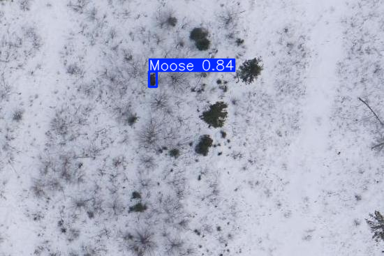

# 🫎 Tracking Moose Using Aerial Object Detection



This repository contains the code, models, and data used in our paper:

**Tracking Moose Using Aerial Object Detection**  
*Christopher Indris, Raiyan Rahman, Goetz Bramesfeld, Guanghui Wang*  
Toronto Metropolitan University, 2025

<link rel="stylesheet" href="https://cdn.jsdelivr.net/gh/jpswalsh/academicons@1/css/academicons.min.css">
<i class="ai ai-arxiv-square ai-2x"></i><a href="https://arxiv.org/abs/2507.21256"> Read the full paper on arXiv: 2507.21256</a>

## 🧠 Project Overview

We explore aerial wildlife tracking with a focus on detecting moose in snowy environments using object detection models onboard drones. The key challenge lies in spotting small objects in high-resolution aerial imagery under strict computational limits.

To address this, we:
- Propose a **multi-scale patching method** to reduce input resolution while maintaining high detection performance.
- Compare **YOLOv11**, **Faster R-CNN**, and **Co-DETR** across different patching configurations.
- Analyze model performance under varying **threshold** and **overlap** parameters.

The result: **YOLOv11**, despite being the lightest model, achieves comparable or better performance than the others—making it well-suited for UAV deployment.

## 📊 Highlights

- **Dataset**: 1694 high-resolution aerial images of moose, divided into patches of varying sizes (large, medium, small). **Available Soon!**
- **Models**: YOLOv11, Faster R-CNN, Co-DETR evaluated across a grid of patching hyperparameters.
- **Best Result**: All models reached ≥93% mAP@IoU=0.5 under at least one configuration.
- **Efficiency**: YOLOv11 achieved 93.2% mAP@0.5 using only 2.6M parameters and ~0.17 sec/iter.

## 🗂️ Repository Structure
- 📁 Notebooks/ --> Python runs
- 📁 R/ --> analysis

## 📦 Requirements

We use **PyTorch**, **Ultralytics YOLO**, and **MMDetection**, and **R** for analysis.
See the .ipynb notebooks for installation details.

## 📚 Citation
If you find this work useful, please consider citing:

```bibtex
@misc{indris2025trackingmooseusingaerial,
      title={Tracking Moose using Aerial Object Detection}, 
      author={Christopher Indris and Raiyan Rahman and Goetz Bramesfeld and Guanghui Wang},
      year={2025},
      eprint={2507.21256},
      archivePrefix={arXiv},
      primaryClass={cs.CV},
      url={https://arxiv.org/abs/2507.21256}, 
}
```

## 🤝 Acknowledgements
This project was supported by the Natural Sciences and Engineering Research Council of Canada (NSERC) under grants ALLRP 588173-23 and ALLRP 570580-21.